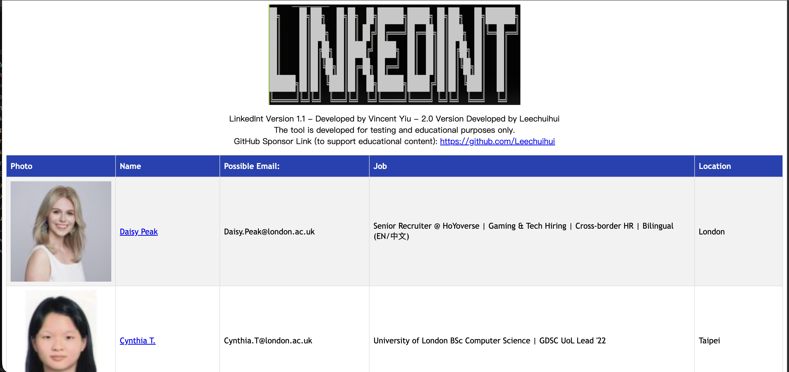

<p align="center">

</p>

# Sponsor Open Source Tooling

* Feel free to sponsor me for maintaining the tool: https://github.com/sponsors/vysecurity

# Disclaimer

* The project is to be used for educational and testing purposes only.

# Authors

* LinkedInt by Vincent Yiu (@vysecurity): https://www.vincentyiu.com | https://vysecurity.rocks
* Original Scraper by Danny Chrastil (@DisK0nn3cT): https://github.com/DisK0nn3cT/linkedin-gatherer
* Developed update by Leechuihui version 2.0
Contributors:

* Leesoh
* harshil-shah004

# Installation
```
git clone https://github.com/vysecurity/LinkedInt
cd LinkedInt
pip install -r requirements.txt
```


# Usage

1. Put in LinkedIn credentials in LinkedInt.cfg
2. Put Hunter.io API key in LinkedInt.cfg
3. Run LinkedInt.py and follow instructions (example below).

# Example

Using General Motors as the target as they have a bug bounty program.

```
██╗     ██╗███╗   ██╗██╗  ██╗███████╗██████╗ ██╗███╗   ██╗████████╗
██║     ██║████╗  ██║██║ ██╔╝██╔════╝██╔══██╗██║████╗  ██║╚══██╔══╝
██║     ██║██╔██╗ ██║█████╔╝ █████╗  ██║  ██║██║██╔██╗ ██║   ██║
██║     ██║██║╚██╗██║██╔═██╗ ██╔══╝  ██║  ██║██║██║╚██╗██║   ██║
███████╗██║██║ ╚████║██║  ██╗███████╗██████╔╝██║██║ ╚████║   ██║
╚══════╝╚═╝╚═╝  ╚═══╝╚═╝  ╚═╝╚══════╝╚═════╝ ╚═╝╚═╝  ╚═══╝   ╚═╝

Providing you with Linkedin Intelligence
Author: Vincent Yiu (@vysec, @vysecurity)
Update by leechuihui 19,May 2026
Original version by @DisK0nn3cT
[*] Enter search Keywords (use quotes for more precise results)
"General Motors"

[*] Enter filename for output (exclude file extension)
generalmotors

[*] Filter by Company? (Y/N):
Y

[*] Specify a Company ID (Provide ID or leave blank to automate):


[*] Enter e-mail domain suffix (eg. contoso.com):
gm.com

[*] Select a prefix for e-mail generation (auto,full,firstlast,firstmlast,flast,first.last,fmlast):
auto

[*] Automatically using Hunter IO to determine best Prefix
[!] {first}.{last}
[+] Found first.last prefix
```

Output (HTML):


